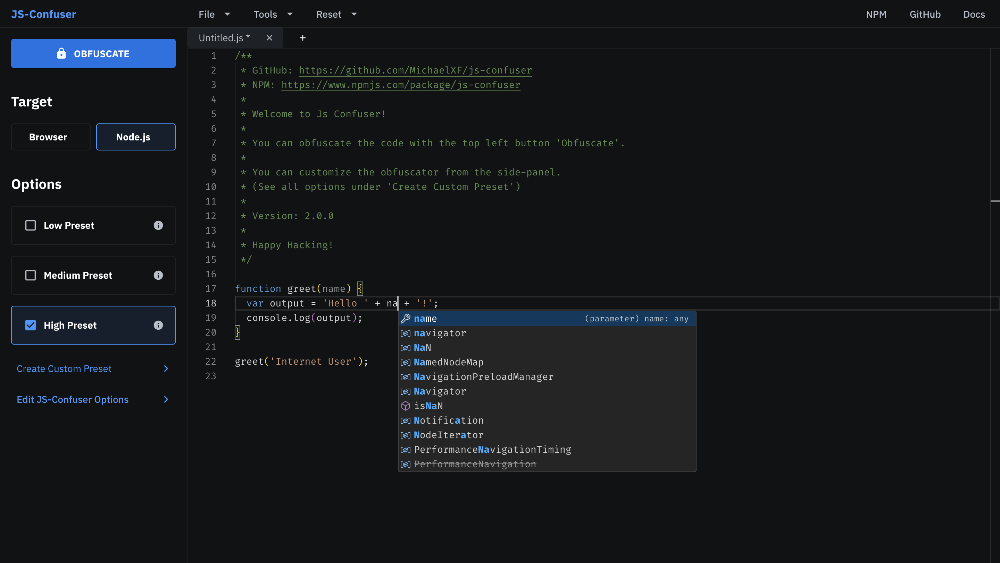
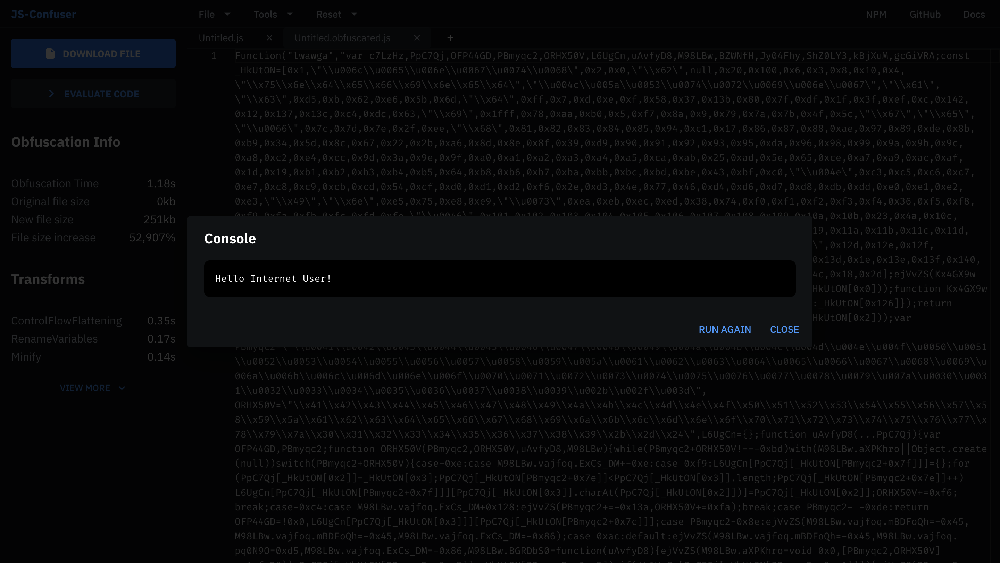

# [Js-Confuser Website](https://js-confuser.com)

Official Web-UI version of [Js-Confuser](https://npmjs.com/package/js-confuser), an open source JavaScript obfuscation tool.

Obfuscate JavaScript online for free with Js-Confuser.

> For any issues regarding the obfuscator itself, please refer to the [Js-Confuser Repo](https://github.com/MichaelXF/js-confuser).

## License

MIT License